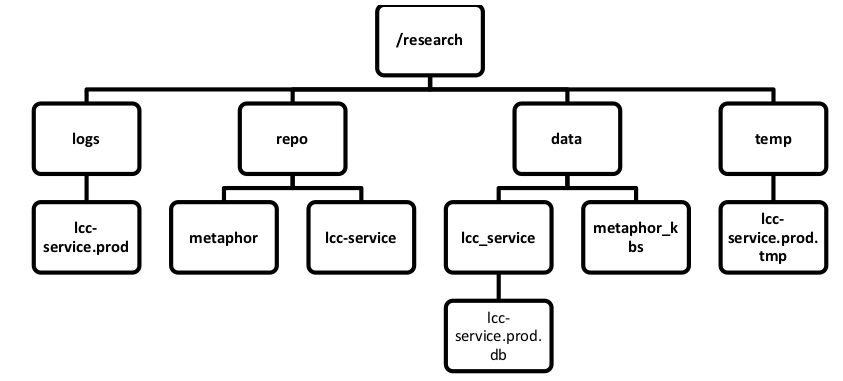

# Metaphor ADP Server

This repository contains a server for running abductive interpretation of
metaphors. It includes a web interface and a JSON API.

## Installation

### Docker

The easiest way to install the server is using Docker.

1. Follow the [instructions](https://docs.docker.com/install) to install
   Docker.

2. Clone the Metaphor ADP server repository:

```
git clone https://github.com/isi-metaphor/metaphor-adp-server
```

3. Build the Docker image for the metaphor server:

```
./build
```

4. Get a license for Gurobi for the virtual machine. Go to
   https://user.gurobi.com/download/licenses/free-academic to get a key
   and then run

```
./run-license [key]
```

The license file will be stored in the `lic` directory.

5. Run the Docker image for the metaphor server:

```
./run
```

The server will now be started on localhost, port 8000. You can send JSON
requests (see, e.g., the `testing` directory in the Metaphor ADP
repository) or use the Web interface: http://localhost:8000/app

The default username and password are both `metaphor`.


### Legacy

The directory structure should look like this:



The instructions below assume you're installing in `/research`, but this can
be any directory you prefer.

This is how to install the entire metaphor pipeline, including the web
service in this repository:

1. Clone repositories for the Metaphor ADP pipeline and for the Henry
   abductive reasoner:

```
mkdir -p /research/repo
cd /research/repo
git clone https://github.com/isi-metaphor/metaphor-adp.git metaphor
git clone https://github.com/isi-metaphor/henry-n700.git henry
```

2. Compile Henry:
- Install dependencies: python-dev, libsqlite3-dev, graphviz and python-lxml
- Compile:

```
cd /research/repo/henry
make -B
```

3. Install Boxer:
- Install Prolog: `sudo apt-get install swi-prolog`
- The official Boxer Subversion repository is no longer available, so
  clone our unofficial Git repository:

```
cd /research/repo
git clone https://github.com/jgordon/boxer
cd boxer
make
make bin/boxer
make bin/tokkie
```
- Uncompress the model in the Boxer installation directory:
```
cd /research/repo/boxer
tar xvjf models-1.02.tar.bz2
```

4. Install Gurobi: Install gurobi in a separate subdirectory of
   installation-dir (called gurobi maybe), and install the license file
   somewhere.

5. Clone the web service and set up its directories:

```
cd /research/rep
git clone https://github.com/isi-metaphor/metaphor-adp-server.git

mkdir -p /research/temp/metaphor-adp-server.tmp
mkdir -p /research/data/metaphor_kbs
mkdir -p /research/data/metaphor-adp-server
mkdir -p /research/logs/metaphor-adp-server
```

6. Install dependencies:

```
sudo apt-get install fabric openssh-server screen
sudo pip install jinja2 django lz4 gitpython pexpect regex sexpdata simplejson
```

7. Deploy the web service: The git clone command just downloads the code
   but then it needs to be configured and deployed.

- Edit the file `fab/config.{branch_name}.json` depending on if
  you want to install the prod or dev branch of the web service
- For local deployment -- that is, on the same machine:
  - Check the function install in fabfile.py to make sure it runs:
    `basic_config(branch_name)`, `local_config()`, `deploy()`
  - Execute `fab install:branch_name`
- For remote deployment -- that is, the deployment directory is on another
  machine to which you have ssh access without password:
  - Edit the ssh username and ssh private key to use (`remote_config` function
    in fabfile.py)
  - Make sure you replace `local_config()` with `remote_config()` in the
    install function in `fabfile.py`
  - Execute `fab install:branch_name`

8. Initialize the database file:
- Go into the deployed directory and run:
```
python2.7 manage.py syncdb --noinput --settings=adpsrv.settings
```
- Create a user for the web interface by running:
```
python2.7 manage.py createsuperuser --username=username_to_create \
    --email=whatever@whatever --settings=adpsrv.settings
```

9. Run:
- Edit the `shell.sh` script to set the name of the screen session it'll start
  (the `-S` option)
- Run the `shell.sh` command
- Within the screen it started, start `temp_run.sh`; for monitored mode
  run `run.sh`.
- Disconnect from the screen (`Ctrl-A D`)


## Acknowledgments

This work was supported by the Intelligence Advanced Research Projects
Activity (IARPA) via Department of Defense US Army Research Lab contract
W911NF-12-C-0025. The US Government is authorized to reproduce and
distribute reprints for Governmental purposes notwithstanding any
copyright annotation thereon. Disclaimer: The views and conclusions
contained herein are those of the authors and should not be interpreted
as necessarily representing the official policies or endorsements,
either expressed or implied, of IARPA, DoD/ARL, or the US Government.
